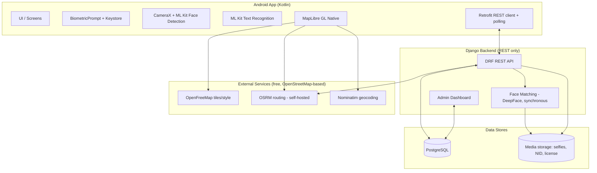
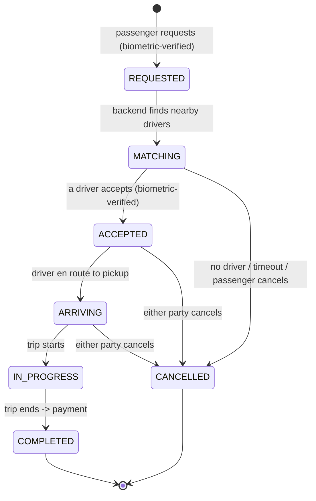

# Aura Ride — Women-Only Ride-Sharing App · Project Specification

> **Demo-scoped, zero-cost build.** This spec deliberately drops production-grade infrastructure a
> 1-month undergraduate demo doesn't need, and anything that costs money: **no Celery, no Redis, no
> PostGIS, no FCM push, no WebSockets, no LLM, no paid APIs.** Google Maps is replaced by the free
> OpenStreetMap stack (MapLibre + OpenFreeMap + OSRM + Nominatim). Real-time behavior uses **REST
> polling**, AI checks run **synchronously**, driver matching is **plain Python**. Full simplification
> list in §16. **The security layer is unchanged and is the point of the project.**

This document is the **authoritative design and API contract**. Both halves of the repo
(`backend/`, `android/`) must match it; change it in the same commit whenever the interface changes.

---

## Table of Contents

1. [Project Overview](#1-project-overview)
2. [Scope (In / Mocked / Out)](#2-scope-in--mocked--out)
3. [Tech Stack](#3-tech-stack)
4. [User Roles](#4-user-roles)
5. [System Architecture](#5-system-architecture)
6. [Security & Identity Verification Pipeline](#6-security--identity-verification-pipeline-core-differentiator) — **core differentiator**
7. [AI Verification Pipeline (Liveness + Face-Match + OCR)](#7-ai-verification-pipeline-liveness--face-match--ocr)
8. [Core Ride-Hailing Features](#8-core-ride-hailing-features)
9. [Payment (bKash mock + Cash)](#9-payment-bkash-mock--cash)
10. [Admin Dashboard](#10-admin-dashboard-web-server-rendered-django)
11. [Data Model / Database Schema](#11-data-model--database-schema)
12. [API Specification (REST + Polling)](#12-api-specification-rest--polling)
13. [Mobile App Structure (Android / Kotlin)](#13-mobile-app-structure-android--kotlin)
14. [Non-Functional Requirements](#14-non-functional-requirements)
15. [Build Plan (4 people, 1 month)](#15-build-plan-4-people-1-month)
16. [Resolved Decisions & Demo Simplifications](#16-resolved-decisions--demo-simplifications)
17. [Technical Notes (Engineering Appendix)](#17-technical-notes-engineering-appendix)

---

## 1. Project Overview

**Aura Ride** is a **women-only** ride-hailing application — comparable to Uber in core function
(request a ride, match to a nearby driver, live-track the trip, pay) — differentiated by a **strict,
multi-layer identity-verification system**. It ensures every registered user (passenger **and**
driver) is a verified woman, and that the person performing a sensitive action is the verified
account owner.

The uniqueness and grading value live in the **security/identity layer** and its **AI-assisted
verification pipeline**. Everything else is standard ride-hailing, kept deliberately lean for a demo.

| | |
|---|---|
| **Platform** | Native **Android (Kotlin)**. Android-only for the demo (no iOS). |
| **Backend** | **Django** (Python) + DRF, REST only. |
| **Region** | **Bangladesh** — drives NID format and OCR language handling (§7). |
| **Payment** | **bKash** (fully internal mock) and **Cash**. |

### Core principles

- **Human-in-the-loop** — AI provides decision *support*; a human admin makes the final approve/reject call.
- **Defense in depth** — identity checked at registration (strong: manual + AI) and re-checked at
  action time (device-bound biometric), with step-up re-verification on risk signals.
- **Data minimization** — store derived representations (extracted fields, face embeddings) rather than
  raw images where possible (§14).
- **Demo pragmatism** — prefer the simplest mechanism that demonstrates the feature; document where
  production would differ.
- **Zero-cost stack** — no paid APIs or billing. All mapping/routing/geocoding uses free
  OpenStreetMap-based tools; ML Kit runs in its free on-device mode; payments and OTP are mocked. The
  whole system runs locally at no cost (§13/§17).

---

## 2. Scope (In / Mocked / Out)

### In scope (must implement)

- Registration: liveness detection + NID upload + device-bound biometric enrollment.
- Admin verification dashboard with AI-assisted review (liveness, face match, NID OCR, license OCR).
- Device-bound biometric re-authentication (challenge-signature) for sensitive actions.
- Ride lifecycle: request → match → accept → in-progress → complete.
- Driver↔passenger matching (in-Python, sequential nearest-first).
- **Live GPS tracking via REST polling** (driver location refreshed every few seconds).
- Payment: **bKash mock** and **Cash** (driver confirms cash received).
- **In-app user dashboard** — role-aware home for passengers and drivers (profile, verification status,
  active ride, recent trips, payment method; driver earnings summary). See §13.4.

### Mocked / simplified (implement a stand-in, documented as such)

- **bKash payment** — fully internal mock behind a `PaymentGateway` interface (no real money/credentials).
- **Phone OTP** — mock OTP (no real SMS provider).
- **NID authenticity check against a government database** — unavailable; replaced by manual admin review + AI assist.

### Out of scope (cut for the 1-month timeline)

- In-app chat between driver and passenger.
- Ratings & reviews.
- Ride history analytics / dashboards.
- Scheduled / future rides.
- Surge / dynamic pricing.
- Push notifications (no FCM — offers delivered by polling).
- Real-time transport (no WebSockets — live updates by polling).
- iOS app.

### Stretch goals (only if ahead of schedule)

- In-ride route-deviation safety monitoring + SOS escalation.

---

## 3. Tech Stack

| Layer | Technology | Rationale |
|---|---|---|
| Mobile | **Kotlin (native Android)** | First-class `BiometricPrompt`, ML Kit, MapLibre; avoids iOS cost. |
| Mobile networking | Retrofit + OkHttp (REST) | Standard; powers requests and polling. |
| Mobile camera/liveness | CameraX + **Google ML Kit Face Detection** | On-device blink + head-angle detection; **free, no key/billing**. |
| Mobile OCR | **Google ML Kit Text Recognition** (on-device) | NID + license field extraction on device; **free, no key/billing**. |
| Mobile biometric | Android Keystore + `BiometricPrompt` | Hardware-backed key, biometric-gated. |
| Mobile maps | **MapLibre GL Native Android** + **OpenFreeMap** style/tiles (OSM) | Free & open-source (BSD); GPU vector maps; **no key, no billing**. |
| Routing / ETA | **OSRM** (self-hosted via Docker, OSM data) | Free; one `/route` call returns geometry + distance + duration (replaces Directions **and** Distance Matrix). |
| Geocoding | **Nominatim** (OSM; public or self-hosted) | Free address ↔ coordinates (forward + reverse). Photon is an optional swap for autocomplete. |
| Backend API | **Django + DRF** | REST only. |
| Database | **PostgreSQL** (plain; no PostGIS) | Matching computed in Python at demo scale. |
| Face matching | **DeepFace** (Python, server-side, synchronous) | Open-source, higher-level API; easiest to integrate. |
| Payment | **bKash mock** + **Cash** | Demo only. |
| Auth tokens | DRF SimpleJWT (access + refresh) | Stateless API auth. |

> **Removed vs a production design:** Celery, Redis, PostGIS, FCM, Django Channels/WebSockets, the LLM,
> and all paid Google Maps APIs (Maps SDK + Directions + Distance Matrix + Geocoding) — replaced by the
> free OpenStreetMap stack above. Rationale and production equivalents in §16.

---

## 4. User Roles

| Role | Description |
|---|---|
| **Passenger** | A verified woman who requests rides. |
| **Driver** | A verified woman who accepts rides and drives. Has a vehicle + driving license. |
| **Admin** | Django's built-in **superuser**. Reviews verification submissions and manages users via the web dashboard. Created internally. |

**One role per account** — an account is either passenger **or** driver, chosen at registration; both
go through the **same** identity-verification pipeline.

---

## 5. System Architecture



### Request paths

- **REST (Retrofit ↔ DRF)** for everything: registration, login, ride request/accept, fare, payment,
  status, and live updates.
- **Live updates use polling** — the passenger app polls ride status + driver location; the driver app
  polls for new ride offers and streams its own location via REST. Intervals in §17.3.
- **AI runs synchronously** inside the backend (DeepFace face matching when a submission is created).
  OCR runs on-device and arrives with the registration payload. See §17.5.

---

## 6. Security & Identity Verification Pipeline (CORE DIFFERENTIATOR)

Three layers:

1. **Registration-time verification** — strong, human + AI.
2. **Action-time re-authentication** — device-bound biometric.
3. **Step-up re-verification** — risk-triggered.

Full biometric mechanics in §17.1.

### 6.1 Registration flow

Applies identically to passenger and driver (drivers add vehicle + license).

```mermaid
sequenceDiagram
    participant U as User (App)
    participant B as Backend (DRF)
    participant A as Admin

    U->>U: Enter basic info (name, phone, email, password, role)
    U->>U: Mock OTP phone verification
    U->>U: Liveness challenge (ML Kit: blink + head turn L/R)
    U->>U: Capture selfie (post-liveness frame)
    U->>U: Capture NID photo; OCR on-device (ML Kit)
    U->>U: (Driver) Capture license photo; OCR on-device
    U->>U: Enroll biometric key (Keystore + BiometricPrompt)
    U->>B: POST /auth/register (info + selfie + NID + OCR fields + public key)
    B->>B: Create User (status = PENDING_REVIEW), store media
    B->>B: Face match (selfie vs NID portrait) -> score  [synchronous]
    B->>B: Cross-check OCR fields vs typed info -> flags
    B->>B: store AI signals (scores, flags)
    A->>B: Open review queue: media + AI signals
    A->>B: Approve or Reject (+ reason)
    B->>B: (on approval) delete raw NID/license images
    B->>U: status = ACTIVE (or REJECTED)
```

**Detailed steps:**

1. **Basic info** — name, phone, email, password, role. Drivers also provide vehicle info (make, model,
   plate, color) and a **driving-license image**.
2. **Phone verification** — **mock OTP** for the demo.
3. **Liveness (on-device, ML Kit)** — randomized sequence (blink / head turn L/R), verified locally via
   eye-open probability + `headEulerAngleY`. Randomized per session to resist replay. Capture selfie on success.
4. **NID capture + on-device OCR** — photo of NID front (back optional); ML Kit extracts fields on device,
   submitted with the image.
5. **License capture + on-device OCR (drivers)** — same approach for the driving license.
6. **Biometric key enrollment** — hardware-backed EC key in Android Keystore; public key sent to backend;
   private key never leaves the device (§17.1).
7. **Submission** — `POST /auth/register` → user `PENDING_REVIEW`; the backend computes the face match and
   cross-checks **synchronously**.
8. **Admin review** — admin sees selfie + NID/license, face-match score, OCR fields, flags; approves/rejects
   with a reason.
9. **Activation** — approval → `ACTIVE`; the backend then **deletes the raw NID/license images**, retaining
   only extracted fields (§14). Rejection notifies the user; resubmission allowed.

### 6.2 Action-time re-authentication (device-bound biometric challenge-signature)

Used for **requesting a ride** (passenger) and **accepting a ride** (driver).

```mermaid
sequenceDiagram
    participant U as App
    participant B as Backend

    U->>B: POST /auth/challenge  (request a nonce for action X)
    B->>U: { nonce, expires_at }  (single-use, server-stored)
    U->>U: BiometricPrompt -> unlock Keystore private key
    U->>U: sign(nonce) with hardware EC key
    U->>B: POST /rides/request  { ..., nonce, signature }
    B->>B: verify signature w/ stored public key; nonce valid+unused+unexpired
    B->>B: consume nonce; proceed
    B->>U: 200 OK / 401
```

**Rules:** nonce single-use, short-lived (~60s), bound to user + action; signature verified against the
enrolled public key. If the key was invalidated (new biometric enrolled), signing fails locally → the app
forces **re-enrollment + step-up** (§6.3).

### 6.3 Step-up re-verification (risk-triggered)

A fresh liveness selfie is face-matched (synchronously) against the **stored registration selfie /
embedding**. Triggered by: biometric key invalidation, new-device login, long inactivity, or random
sampling. Status → `STEP_UP_REQUIRED` until the match passes (low scores escalate to admin).

### 6.4 Threat model (summary — include in writeup)

| Threat | Mitigation | Residual risk |
|---|---|---|
| Remote account hijack (stolen password/token, other device) | Private key never leaves device; per-action signature required | Low |
| Phone theft, attacker lacks biometric & device PIN | Cannot unlock key | Low |
| Phone theft, attacker knows PIN, enrolls own biometric | `setInvalidatedByBiometricEnrollment` destroys key → re-enrollment + step-up face match | Medium |
| Replay of liveness with recorded video | Randomized challenge per session | Medium |
| Impersonation at registration (someone else's NID) | Face match (selfie vs NID portrait) + admin review | Medium |
| Coercion (forcing rightful owner's finger) | None (no biometric scheme prevents this) | Out of scope |
| Non-woman registering | NID gender field (OCR) + admin visual review | Depends on NID/admin |

---

## 7. AI Verification Pipeline (Liveness + Face-Match + OCR)

Liveness and OCR run **on-device** (ML Kit). Face matching runs **server-side, synchronously** in the
backend. All produce **signals** for the admin. **AI never auto-decides.**

### 7.1 Liveness Detection (on-device, ML Kit Face Detection)

Randomized blink + head-turn challenge; verifies a live person (anti-photo). Output:
`liveness_passed: bool` + captured selfie.

### 7.2 Face Matching (server-side, DeepFace, synchronous)

- Detect/crop the face in the selfie and the NID portrait; compute embeddings; **cosine similarity** →
  `face_match_score` (0–1).
- Two thresholds define the verdict band: `T_HIGH` (≥ → `PASS`), `T_LOW` (< → `FAIL`), in-between →
  `REVIEW` (sent to the admin). `0.65` is only a placeholder — calibrate per §7.2.1.
- Computed in-process when the submission is created (and on step-up). At demo scale this takes a second
  or two — acceptable; production would offload to a queue.
- Step-up reuses this: fresh selfie vs stored registration selfie/embedding.

#### 7.2.1 Threshold calibration procedure

The correct cutoff depends on the DeepFace model + distance metric (Facenet512, ArcFace, VGG-Face, etc.
produce different score distributions), so thresholds must be **tuned on your own data, not guessed**.
Re-run whenever you change the model or metric.

1. **Build a labeled validation set.** Collect *genuine* pairs (the same woman's selfie vs her own NID
   portrait) and *impostor* pairs (different people). Aim for ~50–100 of each, in realistic conditions
   (phone lighting, NID photo quality).
2. **Score every pair** with the production face-match function to get a `face_match_score` per pair.
3. **Sweep the threshold** across its range and, at each value, compute:
   - **FAR** (False Accept Rate) — impostor pairs wrongly scored as a match.
   - **FRR** (False Reject Rate) — genuine pairs wrongly scored as a non-match.
4. **Choose the operating point security-first.** Because this gates a women-only safety service,
   prioritize a **low FAR** (keep impostors out) even at the cost of a higher FRR. Set `T_HIGH` where FAR
   is acceptably low.
5. **Set the REVIEW band.** Place `T_LOW` below `T_HIGH` so borderline scores fall into `REVIEW` and reach
   a human admin instead of auto-passing/failing. Widen the band if distributions overlap.
6. **Seed from DeepFace's defaults.** DeepFace publishes recommended thresholds per model/metric — use
   them as the starting prior, then adjust via steps 3–5 on your own set.
7. **Document for the writeup.** Report ROC/AUC and the Equal Error Rate (EER); state the chosen
   `T_HIGH`/`T_LOW` and why. Recalibrate on model changes.

### 7.3 NID + License OCR & Cross-Check (on-device, ML Kit Text Recognition)

- **NID** → `ocr_name`, `ocr_dob`, `ocr_nid_number`, `ocr_gender`.
- **License** (drivers) → `ocr_license_name`, `ocr_license_number`.
- **Cross-checks:** `name_match` (fuzzy vs typed name), `gender_is_female`, `nid_number_present`, `license_name_match`.
- **Flags:** `name_mismatch`, `gender_not_female`, `ocr_low_confidence`, `license_mismatch`.

> **Known limitation:** Bengali-script OCR is significantly less accurate than Latin script. Target the
> **English numerals/fields** on Bangladeshi NIDs/licenses; treat Bengali extraction as best-effort and
> surface low confidence to the admin rather than auto-failing.

### 7.4 Human-in-the-loop & ethics (document in writeup)

- Final approve/reject is **always** a human admin; the admin sees the face-match score, OCR fields, and flags.
- Note **demographic bias** in face recognition (accuracy varies by skin tone/demographics); justify the
  model + threshold; the human-in-the-loop is the primary mitigation.
- Store **face embeddings** for ongoing matching; raw NID/license images are deleted after approval (§14).

---

## 8. Core Ride-Hailing Features

### 8.1 Ride lifecycle (state machine)



### 8.2 Matching algorithm (in-Python, sequential nearest-first)

On `REQUESTED`:

1. Read passenger pickup `(lat,lng)`.
2. Load drivers that are `ONLINE` & `available` with a recent location. **Compute the haversine distance**
   from pickup to each in Python, filter to within radius `R` (e.g. 5 km), and sort by distance. (At demo
   scale — tens of drivers — this is trivially fast; no PostGIS needed.)
3. Offer to the **nearest** driver with a per-driver accept timeout (~15s). The offered driver sees it via
   polling (§8.3); if declined/timeout, offer the next nearest.
4. First driver to accept (with valid biometric signature) wins → `ACCEPTED` (guard against races, §17.8).
5. If none accept within the total timeout → `CANCELLED` (no drivers available).

### 8.3 Live GPS tracking (REST polling)

- **Driver app** (while online / on a trip): `POST /driver/location` with current `(lat,lng)` every 3–5s.
- **Driver app** (while online): polls `GET /driver/offers` every ~3s for an offered ride.
- **Passenger app** (after requesting): polls `GET /rides/{id}` every ~3s for status (and driver info once accepted).
- **Passenger app** (ARRIVING/IN_PROGRESS): polls `GET /rides/{id}/driver-location` every ~3–5s and renders
  the moving marker + route (route geometry from OSRM, drawn on the MapLibre map).
- Backend stores the driver's latest location and (optionally) periodic `RideLocationUpdate` rows for the active ride.
- Apps stop polling when the ride ends or the screen is backgrounded (§17.3).

### 8.4 Fare calculation (simple linear, BDT)

```
fare = base_fare + (distance_km * per_km_rate) + (duration_min * per_min_rate)
```

Distance/duration come from the **OSRM route response** (estimated at request, finalized at completion).
Currency: **BDT**.

### 8.5 Cancellation

Either party may cancel before `IN_PROGRESS`. **No cancellation fee** (demo).

---

## 9. Payment (bKash mock + Cash)

Two methods; the passenger picks one per ride (default configurable).

### 9.1 bKash (fully internal mock)

- Behind a `PaymentGateway` interface (`BkashMockGateway`) so a real bKash integration can replace it later.
- Flow: on `COMPLETED` with method = bKash → create `Payment` (`PENDING`) → passenger app shows a mock bKash
  screen (mock number + mock PIN) → gateway "processes" → `Payment` `COMPLETED`/`FAILED`.
- No real money/credentials; UI labeled as a demo.

### 9.2 Cash

- Passenger selects **Cash**.
- On `COMPLETED`, the driver collects cash and taps **"Paid"** in the driver app.
- Backend marks `Payment` `COMPLETED` with method = `CASH`, recording the confirming driver + timestamp (no
  gateway reference).

---

## 10. Admin Dashboard (Web, server-rendered Django)

Built as **customized Django Admin / server-rendered Django templates** (no SPA). Admin auth = Django's
built-in superuser (`createsuperuser`), separate from app users.

- **Verification queue** — `PENDING_REVIEW` list; detail view shows selfie + NID/license side by side,
  face-match score, OCR fields + flags, and Approve / Reject (+ reason).
- **Step-up queue** — low-score step-up cases needing manual confirmation.
- **User management** — list/search, status, suspend/reactivate.
- **Ride monitor (basic)** — active/recent rides and states.
- All approve/reject actions **audit-logged** (admin id, timestamp, reason).

---

## 11. Data Model / Database Schema

Add `created_at` / `updated_at` to all models. Locations are stored as plain `lat`/`lng` float pairs (no PostGIS).

### User & profiles

```
User
  id (PK); email (unique); phone (unique); password (hashed); full_name
  role: enum[PASSENGER, DRIVER]
  status: enum[PENDING_REVIEW, ACTIVE, REJECTED, SUSPENDED, STEP_UP_REQUIRED]
  is_phone_verified: bool
  date_joined

PassengerProfile
  user (FK -> User, 1:1)
  default_payment_method: enum[BKASH, CASH]

DriverProfile
  user (FK -> User, 1:1)
  license_image (media path; deleted after approval)
  is_online: bool; is_available: bool
  current_lat: float (nullable); current_lng: float (nullable)
  last_location_at

Vehicle
  driver (FK -> DriverProfile)
  make; model; color; plate_number
```

### Verification & biometric

```
VerificationSubmission
  user (FK -> User)
  selfie_image (media path)           # may be reduced to embedding post-approval
  nid_image_front (media path; deleted after approval)
  nid_image_back (media path, nullable; deleted after approval)
  liveness_passed: bool
  face_match_score: float (nullable); face_match_verdict: enum[PASS,REVIEW,FAIL]
  ocr_name; ocr_dob; ocr_nid_number; ocr_gender (nullable)
  ocr_license_name; ocr_license_number (nullable)   # drivers
  flags: JSON                          # {name_mismatch, gender_not_female, ocr_low_confidence, license_mismatch,...}
  status: enum[PENDING_REVIEW, APPROVED, REJECTED]
  reviewed_by (FK -> Admin/superuser, nullable); review_reason (nullable)
  is_step_up: bool

BiometricCredential
  user (FK -> User, 1:1)
  public_key (PEM); device_id; is_active: bool; enrolled_at

FaceEmbedding
  user (FK -> User); embedding (bytes/vector); source: enum[REGISTRATION_SELFIE]
```

### Ride & payment

```
Ride
  passenger (FK -> User); driver (FK -> User, nullable until accepted)
  status: enum[REQUESTED, MATCHING, ACCEPTED, ARRIVING, IN_PROGRESS, COMPLETED, CANCELLED]
  pickup_lat; pickup_lng; pickup_address
  dropoff_lat; dropoff_lng; dropoff_address
  estimated_fare; final_fare (nullable)
  estimated_distance_km; estimated_duration_min
  payment_method: enum[BKASH, CASH]
  offered_driver (FK -> User, nullable); offer_expires_at (nullable)   # current sequential offer
  requested_at; accepted_at; started_at; completed_at; cancelled_at
  cancelled_by: enum[PASSENGER, DRIVER, SYSTEM] (nullable)

RideLocationUpdate
  ride (FK -> Ride); lat: float; lng: float; recorded_at

ActionChallenge
  user (FK -> User); nonce (unique); action_type: enum[REQUEST_RIDE, ACCEPT_RIDE,...]
  is_used: bool; expires_at

Payment
  ride (FK -> Ride, 1:1); amount
  method: enum[BKASH_MOCK, CASH]
  status: enum[PENDING, COMPLETED, FAILED]
  gateway_reference (nullable; mock txn id, null for cash)
  confirmed_by (FK -> User, nullable)   # driver who tapped "Paid" for cash
  paid_at (nullable)

SafetyReport   # stretch
  ride (FK -> Ride, nullable); reporter (FK -> User); description
  severity: enum[LOW, MEDIUM, HIGH] (nullable)
  status: enum[OPEN, REVIEWING, RESOLVED]
```

---

## 12. API Specification (REST + Polling)

Base URL `/api/v1`. Auth: `Authorization: Bearer <JWT>` unless noted. JSON; media via
`multipart/form-data`. Live updates come from clients **polling** the GET endpoints below (no WebSocket).

### 12.1 Auth & registration

| Method | Path | Auth | Body / Notes | Response |
|---|---|---|---|---|
| POST | `/auth/register` | none | multipart: info, `role`, `selfie`, `nid_front`, `nid_back?`, OCR fields, `public_key`; driver-only: vehicle fields + `license` + license OCR | `201 {user_id, status}` |
| POST | `/auth/verify-phone` | none | `{phone, otp}` (mock) | `200 {is_phone_verified}` |
| POST | `/auth/login` | none | `{email/phone, password}` | `200 {access, refresh, status}` (block unless ACTIVE/STEP_UP_REQUIRED) |
| POST | `/auth/refresh` | none | `{refresh}` | `200 {access}` |
| POST | `/auth/challenge` | yes | `{action_type}` | `200 {nonce, expires_at}` |
| POST | `/auth/biometric/reenroll` | yes | `{public_key, device_id}` | `200` |
| POST | `/auth/step-up` | yes | multipart: `selfie` | `200 {face_match_score, verdict, status}` |

### 12.2 Profile & status

| Method | Path | Auth | Notes |
|---|---|---|---|
| GET | `/me` | yes | current user + status |
| GET | `/me/verification-status` | yes | submission status + (if rejected) reason |

### 12.3 Driver

| Method | Path | Auth | Notes |
|---|---|---|---|
| POST | `/driver/online` | yes (driver) | `{is_online, lat, lng}` go online/offline |
| POST | `/driver/location` | yes (driver) | `{lat, lng}` periodic update (every 3–5s while online) |
| GET | `/driver/offers` | yes (driver) | **poll (~3s):** current ride offer for this driver or `null` |
| POST | `/driver/rides/{id}/accept` | yes (driver) | `{nonce, signature}` (biometric) |
| POST | `/driver/rides/{id}/arrive` | yes (driver) | mark arrived |
| POST | `/driver/rides/{id}/start` | yes (driver) | start trip |
| POST | `/driver/rides/{id}/complete` | yes (driver) | end trip → payment |
| POST | `/driver/rides/{id}/cash-paid` | yes (driver) | confirm cash received |
| GET | `/driver/summary` | yes (driver) | `{today_earnings, total_earnings, completed_trips, is_online}` |

### 12.4 Passenger / rides

| Method | Path | Auth | Notes |
|---|---|---|---|
| POST | `/rides/estimate` | yes | `{pickup, dropoff}` → `{estimated_fare, distance, duration}` |
| POST | `/rides/request` | yes (passenger) | `{pickup, dropoff, payment_method, nonce, signature}` |
| GET | `/rides/{id}` | yes | **poll (~3s):** ride detail + status + driver info |
| GET | `/rides/{id}/driver-location` | yes | **poll (~3–5s):** `{lat, lng, ts}` during ARRIVING/IN_PROGRESS |
| POST | `/rides/{id}/cancel` | yes | cancel |
| GET | `/rides/history` | yes | basic; optional |

### 12.5 Payment

| Method | Path | Auth | Notes |
|---|---|---|---|
| POST | `/payments/{ride_id}/bkash` | yes (passenger) | `{mock_bkash_number, mock_pin}` → process mock |
| GET | `/payments/{ride_id}` | yes | payment status |

(Cash is confirmed by the driver via `/driver/rides/{id}/cash-paid`.)

### 12.6 Real-time via polling (no WebSocket)

Clients achieve "live" behavior by polling the GET endpoints above on a timer:

- **Driver online:** `GET /driver/offers` (~3s) + `POST /driver/location` (~3–5s).
- **Passenger waiting/active:** `GET /rides/{id}` (~3s) and, once ARRIVING/IN_PROGRESS,
  `GET /rides/{id}/driver-location` (~3–5s).
- Stop all timers when the ride reaches a terminal state or the relevant screen is backgrounded. See §17.3
  for strategy and tradeoffs.

---

## 13. Mobile App Structure (Android / Kotlin)

### 13.1 Key components

- **Biometric** — `BiometricPrompt` + `KeyGenParameterSpec` (EC, `setUserAuthenticationRequired(true)`,
  `setInvalidatedByBiometricEnrollment(true)`, `BIOMETRIC_STRONG`, no `DEVICE_CREDENTIAL` fallback). Sign
  nonces with the Keystore key (§17.1).
- **Liveness** — CameraX + ML Kit `FaceDetector` (classification for eye-open probability +
  `headEulerAngleY`); randomized challenge state machine.
- **OCR** — ML Kit Text Recognition on the captured NID/license images.
- **Maps** — **MapLibre GL Native Android** (`org.maplibre.gl:android-sdk`) rendering an **OpenFreeMap**
  vector style (free OSM tiles, no key); route geometry + ETA from **OSRM**; address ↔ coordinate lookups
  via **Nominatim**.
- **Networking** — Retrofit + OkHttp; JWT interceptor with refresh; a lightweight **polling loop**
  (coroutine/`Handler`) for live updates.

### 13.2 Passenger flow

Splash/auth gate → Register (info → mock OTP → liveness → selfie → NID + OCR → biometric enroll → pending)
→ Login → Home/map (set pickup/dropoff → estimate, choose bKash/Cash) → Confirm (**BiometricPrompt**) →
polling for status → live tracking (poll driver location) → Completed → payment (mock bKash or cash) →
Step-up screen when required.

### 13.3 Driver flow

Register (same pipeline + vehicle + license OCR) → Online/offline toggle (starts location updates + offer
polling) → Incoming offer (from `GET /driver/offers`) → **BiometricPrompt** to accept → navigate → arrive
→ start → complete → (cash) tap "Paid".

### 13.4 In-App User Dashboard

The role-aware **home screen** shown after login once `status = ACTIVE` (the "Home" in §13.2/§13.3).
Read-mostly; pulls from existing endpoints.

**Shared (both roles)**

- Profile header: name, avatar, role, account-status badge (Active / Step-up required).
- Verification status; if `STEP_UP_REQUIRED`, a banner linking to step-up.
- Active-ride card (if any): current status, ETA, tap-through to the live map.
- Recent trips (basic list from `/rides/history`).
- Default payment method (bKash / Cash) with quick switch.
- Settings / logout.

**Passenger dashboard**

- Primary CTA: **Request a ride** → map (pickup/dropoff) → estimate → biometric confirm.
- Recent trips with fare + status.

**Driver dashboard**

- **Online/offline toggle** (controls availability + location updates + offer polling).
- Incoming ride-offer surface while online.
- **Earnings summary** — today + total (sum of `COMPLETED` payments where driver = me) + completed-trip
  count, from `GET /driver/summary`. Lightweight aggregates only.
- Vehicle info; recent trips driven.

**Data sources:** `/me`, `/me/verification-status`, `/rides/history`, `/rides/{id}`, and (driver)
`/driver/summary`. No new database models required — the driver summary aggregates `Payment` rows for
completed rides.

---

## 14. Non-Functional Requirements

### Security & privacy

- All traffic over **HTTPS** (in production); passwords hashed (argon2/PBKDF2).
- **Biometric private keys never leave the device**; backend stores only public keys.
- Nonces single-use, short-lived, action-bound; rate-limit auth + challenge endpoints.
- **Sensitive data handling:**
  - **Delete raw NID and license images after approval** (in the backend, on approval); retain only
    extracted fields (and optionally an audit hash). Store **face embeddings** for matching; minimize
    retention of raw selfies.
  - Restrict media access to admins; never expose via public URLs (admin-only / signed short-lived URLs).
  - Obtain explicit **consent** for biometric/ID processing at registration.
- **Access control:** role-based; users access only their own rides; app users cannot reach admin endpoints.

### Performance

- Matching computed in Python over the small set of online drivers — fast at demo scale.
- Poll intervals chosen to feel live without hammering the server (3–5s); stop when not needed.

### Reliability

- Polling with sensible intervals and backoff on errors; resume on reconnect.
- Idempotent, race-safe ride transitions (first-accept-wins; §17.8).

---

## 15. Build Plan (4 people, 1 month)

Stand up an **OSRM** routing server (Docker + a Dhaka/Bangladesh OSM extract from Geofabrik) in **week 1**;
MapLibre + OpenFreeMap need no key or billing. Protect the critical path; keep out-of-scope items out. The
simplified stack (Django + Postgres + REST) is fast to stand up.

**Workstream split (one owner each):**

1. **Security/Identity** — registration API, biometric enrollment + nonce-signature verification, step-up, JWT/auth.
2. **AI + Admin** — on-device liveness/OCR, synchronous face-match (DeepFace), admin review UI, NID deletion on approval.
3. **Ride core** — in-Python matching, ride state machine, offer/location/status **polling endpoints**.
4. **Mobile UI + Maps + Payment + Integration/Testing** — screens, Maps, polling loops, bKash mock + cash, glue, end-to-end testing.

**Milestones:**

| Week | Goal |
|---|---|
| 1 | Scaffolding (Django + DRF + PostgreSQL), Android skeleton, MapLibre map rendering (OpenFreeMap style), OSRM server up, models migrated, auth + JWT. |
| 2 | Registration end-to-end (liveness → OCR → selfie/NID upload → biometric enroll → pending); synchronous AI signals; admin approve/reject. |
| 3 | Ride core: request → matching → accept (biometric) → polling-based live tracking → complete; bKash mock + cash. |
| 4 | Integration, step-up flow, raw-image deletion, hardening, threat-model writeup, demo polish. Stretch only if green. |

**Highest-risk points:** real-device biometric behavior (test on physical phones early), OSRM server setup
(importing the OSM extract), face-match threshold tuning, polling cadence (balance "live feel" vs server load).

---

## 16. Resolved Decisions & Demo Simplifications

**Assumptions (confirmed):**

- **A1** Android-only, native Kotlin; no iOS.
- **A2** Region = Bangladesh.
- **A3** One role per account (passenger XOR driver).
- **A4** bKash = internal mock behind a `PaymentGateway` interface.
- **A5** Admin dashboard = server-rendered Django; admin = Django superuser.
- **A6** Sequential nearest-first matching (computed in Python).
- **A7** Simple linear fare model; currency BDT.
- **A8** App name = **Aura Ride**.

**Open decisions (resolved):**

1. App name: Aura Ride.
2. Face-match library: DeepFace.
3. OCR: on-device ML Kit Text Recognition.
4. Phone OTP: mock OTP for the demo.
5. Driver's license: stored image **plus OCR** + cross-check (deleted after approval like the NID).
6. NID retention: delete raw NID/license images after approval; keep extracted fields.
7. Payment: **Cash** (driver taps "Paid") **and** bKash (fully internal mock).
8. Accounts: one role only.
9. Cancellation fee: none.

**Demo simplifications (deliberately removed; production equivalent noted):**

| Removed | Replaced with (demo) | Production equivalent |
|---|---|---|
| Celery + Redis (async jobs) | Synchronous AI checks in-request | Task queue (Celery/RQ) + Redis |
| PostGIS | Haversine in Python over online drivers | PostGIS `ST_DWithin` + spatial index |
| FCM push notifications | Driver polls `GET /driver/offers` | FCM push of ride offers |
| Django Channels / WebSockets | REST polling of status + driver location | WebSocket live streams |
| Google Maps Platform (paid-tier APIs) | **MapLibre + OpenFreeMap** (tiles), **OSRM** (routing + ETA), **Nominatim** (geocoding) — all free/OSS, OSM-based | Google Maps SDK + Directions + Distance Matrix + Geocoding APIs |
| Small LLM approval recommendation | Admin reads face-match score + OCR flags directly | LLM decision-support summary |

> Document these in the report as **conscious engineering tradeoffs** (demo scope vs production), not
> omissions — that framing is academically stronger.

---

## 17. Technical Notes (Engineering Appendix)

Expands the parts most likely to be misimplemented. **Read before building the security or polling layers.**

### 17.1 Device-bound biometric authentication (in depth)

**Goal.** Prove, per sensitive action, that (a) the request comes from the *same physical device* enrolled
at registration, and (b) a *valid biometric* was just presented on that device — without ever transmitting
or storing the user's fingerprint.

**Why fingerprints are not stored.** Android's biometric sensor never exposes raw fingerprint data to apps.
The OS only reports a match against fingerprints enrolled *on the device*, and the template stays in secure
hardware (TEE, or StrongBox where available). Aura Ride therefore stores a **public key**; the matching
fingerprint merely *unlocks* the corresponding private key on the device.

**The primitive: a hardware-backed key pair.** At registration the app generates an **EC P-256** key pair
in the Android Keystore. The private key is non-exportable and bound to the user's biometric; only the
public key goes to the server.

```kotlin
val kpg = KeyPairGenerator.getInstance(KeyProperties.KEY_ALGORITHM_EC, "AndroidKeyStore")
val spec = KeyGenParameterSpec.Builder(
        "aura_ride_biometric_key",
        KeyProperties.PURPOSE_SIGN or KeyProperties.PURPOSE_VERIFY)
    .setAlgorithmParameterSpec(ECGenParameterSpec("secp256r1"))
    .setDigests(KeyProperties.DIGEST_SHA256)
    .setUserAuthenticationRequired(true)            // key usable only after biometric auth
    .setInvalidatedByBiometricEnrollment(true)      // enrolling a new fingerprint destroys the key
    .setIsStrongBoxBacked(true)                     // prefer StrongBox if the device has it
    .build()
kpg.initialize(spec)
val keyPair = kpg.generateKeyPair()                 // send keyPair.public (X.509/PEM) to backend
```

**Enrollment (one-time).** Generate the key pair → send the public key (+ a `device_id`) to
`POST /auth/register` (or `/auth/biometric/reenroll` for step-up) → backend stores it in `BiometricCredential`.

**Per-action challenge–response (nonce signing).**

1. App calls `POST /auth/challenge` with `action_type`; server returns a random, single-use, short-lived
   `nonce` (stored in `ActionChallenge`).
2. App initializes a `Signature` with the private key, wraps it in a `BiometricPrompt.CryptoObject`, and
   calls `BiometricPrompt.authenticate(...)`.
3. On biometric success, the app signs the nonce and sends `{nonce, signature}` with the action request.
4. Server verifies the signature against the stored public key, checks the nonce is valid/unused/unexpired,
   **consumes** it, and proceeds.

```kotlin
val sig = Signature.getInstance("SHA256withECDSA")
val priv = (KeyStore.getInstance("AndroidKeyStore").apply{load(null)})
            .getKey("aura_ride_biometric_key", null) as PrivateKey
sig.initSign(priv)
biometricPrompt.authenticate(promptInfo, BiometricPrompt.CryptoObject(sig))
// onAuthenticationSucceeded:
val s = result.cryptoObject!!.signature!!
s.update(nonce.toByteArray(Charsets.UTF_8))
val signatureB64 = Base64.encodeToString(s.sign(), Base64.NO_WRAP)
```

```python
# Server-side verify (cryptography lib)
public_key = load_pem_public_key(cred.public_key.encode())
public_key.verify(base64.b64decode(signature_b64),
                  nonce.encode(),
                  ec.ECDSA(hashes.SHA256()))   # raises on failure
```

**Security properties.**

- *Remote hijack resistance* — a stolen password/token or a dumped database yields no private key, so an
  attacker on another device cannot produce a valid signature.
- *Recency* — `setUserAuthenticationRequired(true)` ties each signing operation to a fresh biometric prompt.
- *Theft + re-enrollment* — `setInvalidatedByBiometricEnrollment(true)` destroys the key when a new
  fingerprint is enrolled, so a thief who knows the device PIN cannot silently inherit the account —
  signing breaks and the app forces re-enrollment + a step-up face match.
- *No PIN shortcut* — use `BIOMETRIC_STRONG` only (no `DEVICE_CREDENTIAL` fallback) for ride actions.

**Limitations (state honestly in the writeup).** This proves "same device + valid biometric," which
ultimately reduces to device security; it does not by itself prove "same human as the NID," and cannot
prevent coercion. Those gaps are why Aura Ride adds **step-up liveness + face match** (§6.3). Conceptually
this is a lightweight **FIDO2/WebAuthn**-style challenge-response.

### 17.2 Authentication & sessions

DRF SimpleJWT issues short-lived access tokens + longer refresh tokens. Login is blocked unless
`status ∈ {ACTIVE, STEP_UP_REQUIRED}`. The biometric layer (§17.1) is **separate** from JWT and gates
specific actions, not session establishment.

### 17.3 Real-time via REST polling

There is no WebSocket. Clients simulate live behavior by polling on timers:

- **Driver (online):** `GET /driver/offers` ~every 3s for a pending offer; `POST /driver/location` ~every 3–5s.
- **Passenger (waiting):** `GET /rides/{id}` ~every 3s for status.
- **Passenger (trip active):** `GET /rides/{id}/driver-location` ~every 3–5s for the marker.

Guidelines: run timers only while the relevant screen is foregrounded and the ride is non-terminal; cancel
them on completion/cancellation and on `onPause`; add jitter/backoff on errors. Tradeoff vs WebSockets:
simpler infrastructure and trivially local-testable, at the cost of a few seconds of latency and some
redundant requests — acceptable for a demo. Production would push updates over a persistent connection.

### 17.4 Driver matching (in-Python)

Each online driver's last `(lat,lng)` is kept on `DriverProfile`. On a ride request, load online+available
drivers with a recent location, compute the **haversine distance** to the pickup in Python, filter to radius
`R`, and sort ascending. Offer sequentially (nearest first) using `Ride.offered_driver` + `offer_expires_at`;
on timeout/decline, advance to the next. At demo scale (tens of drivers) this is microseconds; for production
scale you would switch to PostGIS with a spatial index.

### 17.5 AI pipeline execution (synchronous)

Face matching (DeepFace) runs **in-process** during the `POST /auth/register` request (and on step-up).
Expect a 1–2s added latency; show a "verifying…" state. OCR runs on-device and arrives with the payload.
Raw NID/license images are **deleted in the backend on approval**. No background workers are used. Production
would move face matching and any heavy work to a task queue so the request returns immediately.

### 17.6 Liveness anti-spoofing

The challenge sequence is **randomized per session** (e.g. blink → turn left → turn right in random order)
so a pre-recorded video cannot satisfy an unpredictable prompt. Passive presentation-attack detection
(screen/photo replay) is out of scope; document as a known limitation, mitigated by admin review of the selfie.

### 17.7 Sensitive media storage & retention

Raw NID/license images live in restricted media storage, never behind public URLs — serve to admins only via
authenticated/short-lived links. After approval, raw NID/license images are **deleted**; only extracted
fields (and optionally an audit hash) and the face embedding remain. This minimizes breach blast radius and
matches data minimization.

### 17.8 Concurrency: first-accept-wins

Even with sequential offers, a stale offer can race a cancel or a re-offer. Guard ride transitions with a
DB-level conditional update / row lock (e.g. `UPDATE ... WHERE status='MATCHING' AND offered_driver=:me` and
check affected rows, or `select_for_update()`), so exactly one `accept` succeeds and late accepts get "offer
expired." Make all transition endpoints idempotent.

### 17.9 Ride-offer delivery (polling, no push)

Because there's no FCM, a driver learns of an offer by polling `GET /driver/offers` while online. The backend
sets `Ride.offered_driver` + `offer_expires_at`; the endpoint returns that ride to the offered driver (or
`null`). Keep the offer window (~15s) comfortably larger than the poll interval (~3s) so an offer is never
missed. Production would push the offer via FCM so the driver app need not poll.

### 17.10 Maps, routing & geocoding (free OpenStreetMap stack)

No Google Maps, no API keys, no billing.

- **Map rendering** — **MapLibre GL Native Android** (`org.maplibre.gl:android-sdk`, BSD-licensed). Point it
  at a free vector style — **OpenFreeMap** (`https://tiles.openfreemap.org/styles/liberty`) serves
  OpenStreetMap-based vector tiles with **no key**. Alternatives needing no key: Carto basemap styles, or
  self-hosted **PMTiles/Protomaps** (a single static file served from disk) for full control or offline use.
- **Routing + ETA** — **OSRM**, self-hosted with Docker. Download a small OSM extract (e.g. Dhaka or
  Bangladesh from Geofabrik), run `osrm-extract`/`osrm-partition`/`osrm-customize`, then `osrm-routed`. A
  single `GET /route/v1/driving/{lon,lat};{lon,lat}?overview=full&geometries=geojson` returns the polyline
  **plus** distance and duration — covering both route display and fare estimation, replacing Directions and
  Distance Matrix in one call. For a zero-setup quick demo, the public OSRM/FOSSGIS demo server works but has
  usage limits and no SLA, so self-host for anything you'll actually present.
- **Geocoding** — **Nominatim** (OSM) for address → coordinates (`/search`) and coordinates → address
  (`/reverse`). The public instance at `nominatim.openstreetmap.org` is free but enforces a strict usage
  policy — **max 1 request/second, a valid identifying `User-Agent`, and visible attribution** — so cache
  results and throttle. Self-host via the `mediagis/nominatim` Docker image (with a Bangladesh extract) if
  you exceed that. For search-as-you-type autocomplete, **Photon** (Komoot; prebuilt country indexes
  downloadable) is the better free option.
- **Attribution** — OSM data is ODbL; display "© OpenStreetMap contributors" on the map (and credit
  OpenFreeMap/OpenMapTiles per their style). MapLibre shows an attribution control by default; keep it visible.
- **Local dev** — OSRM and (optionally) Nominatim run as local Docker containers, and OpenFreeMap is a remote
  free service — so the whole maps stack works on your machine with no account, key, or spend.

### 17.11 Simplified stack note

With Celery, Channels, and FCM removed, **Redis is no longer needed anywhere**. The runtime is just Django
(WSGI is fine — no ASGI required without WebSockets) + PostgreSQL, which is far simpler to run locally and
demo. If you later re-introduce WebSockets you'll need ASGI (Daphne/Uvicorn) and a channel layer again.
